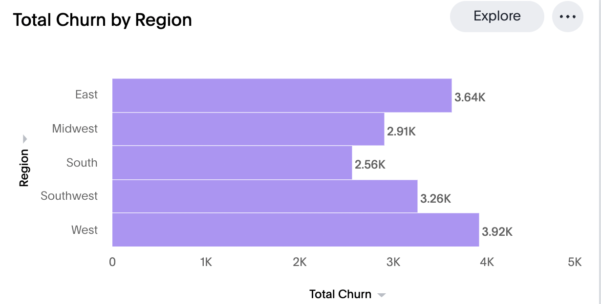
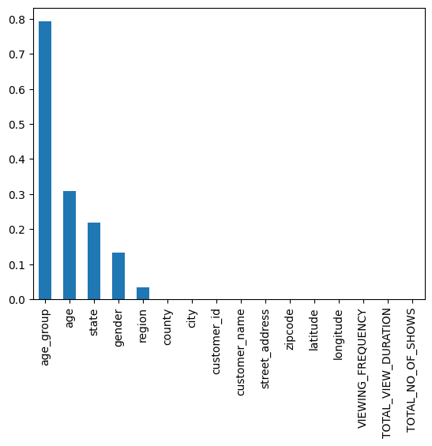
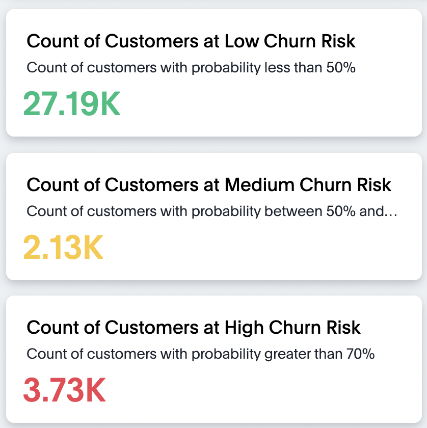
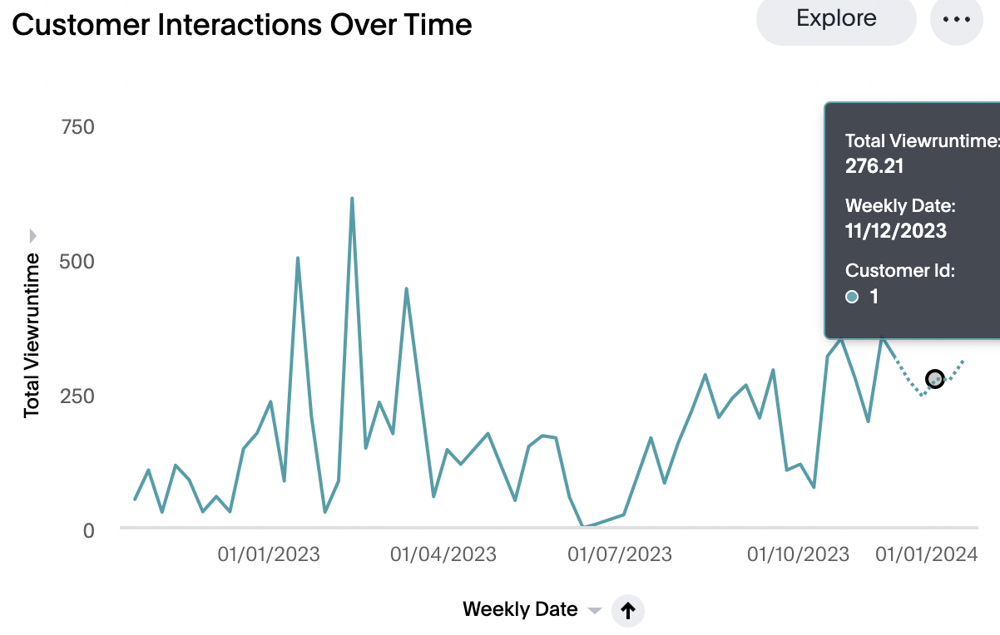
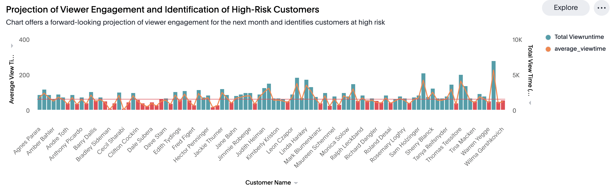

# python-churn-analysis
Churn prediction and forecasting using python, GCP and Databricks

# 🚀 Spotflix Churn Prediction and Forecast

Ever wondered how streaming platforms keep you hooked? Well, churn prediction is their secret weapon! 🍿 behavior. It's a crystal ball for understanding customer behavior, foreseeing when users might say goodbye to our streaming world.

So, how does this magic work?  🎩✨ With Spotflix's data treasure, we explore user interactions, preferences, and habits. It's like a backstage pass helping us figure out what makes users binge-watch and what might make them take a break. Come along as we explore the future of streaming engagement! 🚀🎬

## Overview

In this project, we utilize machine learning techniques in Python, BigQuery ML, and Databricks ML to predict customer churn and forecast user engagement patterns.

We dive into customer demographics, show data, and subscription information to uncover insights that guide strategic decisions.

## Churn Prediction

### Connection Establishment

We initiate by establishing connections to the respective databases using Python and their native APIs for data analysis.

### Data Selection
We thoughtfully gather customer demographics, show data, and subscription information to enable a comprehensive analysis.

### Data Preprocessing
Before diving into machine learning, we perform crucial data preprocessing steps:

- Calculated Columns: Create a churn column using open and close date columns.
- Feature Engineering: Transform existing columns like view duration to derive meaningful insights.
- Data Cleaning: Tidy up the dataset by handling missing values, ensuring consistency, and imputing null values strategically.
- Encoding: Prepare the data for model training by encoding categorical columns.

### 🌍 Discover who's sticking around and who's saying goodbye 

### Feature Selection and Model Training
Prior to training machine learning models, we conduct feature selection using chi-square test. The selection is based on significant columns identified through chi-square testing. Finally, we train a Random Forest model, evaluating performance metrics like MSE and R2.

### 🎲 Exploring Features: Dive into the impact each feature adds to our churn prediction game. 📊

### Heatmap of Confusion Matrix: it's a glimpse into the accuracy and missteps of our churn predictions.

### The Churn Risk Spectrum 📊 : 📈 We're not just predicting churn; we're classifying risk levels! Low, medium, or high 📉

## Time Series Forecasting
### Connection Establishment
Similar to churn prediction, we establish a seamless connection to the Snowflake database using Snowpark Python.

### Data Selection
For time series forecasting, we focus on historical customer and subscription data, preparing it for in-depth analysis.

### Data Transformation and Aggregation
Transforming Snowflake data into a Pandas DataFrame, we aggregate based on 'view date' and derive additional insights such as the days a customer spent before leaving the platform.

### Model Selection and Tuning
Choosing the XGBoost Regressor for its prowess in handling intricate data relationships, we fine-tune parameters like the learning rate, maximum depth, and number of estimators.

### Streamlined Training and Forecasting
To streamline the entire process, we implement functions for creating datasets at the customer level, training models, and forecasting for various time periods.

### Forecast for Next Month: 🚀 a sneak peek into the future of Spotflix

Now our XGBoost model is ready to start forecasting customer viewing pattern for the next 6 months or 1 year. This will give us crucial insights to make better decisions.

### Witness how we predict engagement levels and pinpoint those high-risk viewers 🌟

## Guide to use .tml files
For step-by-step instructions on how to import .tml files into your ThoughtSpot cluster please refer [How to use TML files](https://docs.thoughtspot.com/cloud/latest/scriptability#_how_to_use_tml_files)
